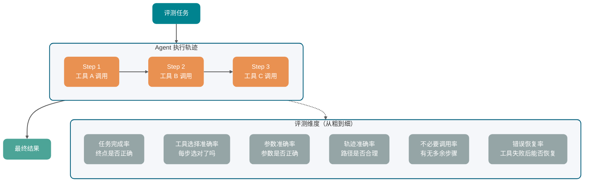
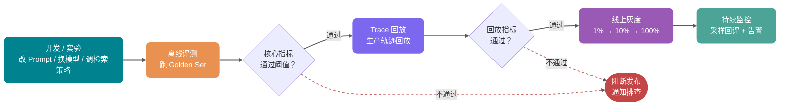

客服 RAG 升级混合检索和 Reranker 后，最容易出现的上线判断是：本地挑几十条问题跑一遍，答案比旧版顺，就觉得可以放量。

一周后，业务方反馈：“有些问题感觉还不如以前准。”

真正难处理的是缺少基线。旧版本在退换货、物流查询、商品参数对比上的命中率分别是多少？新版本退步的是哪一类问题？业务方说“不如以前准”，到底是质量回退，还是用户预期变高？上线前没有评测记录，排查只能回到原始对话里一条条翻。

很多 AI 应用早期都会卡在这里：上线靠体感，回滚靠体感，改完之后有没有进步还是靠体感。

没有评测集，后面的模型选择、Prompt 调整、检索优化和灰度发布都缺少同一把尺子。

后文围绕一条主线展开：先把 Golden Set、Task、Trial、Grader、Trace 这些对象讲清楚，再看人工评测、规则评测、LLM-as-Judge 怎么组合，最后把 RAG、Agent、结构化输出、线上灰度和 CI 自动回归串到同一套流程里。

说明一下：RAGAS、TruLens、LangSmith、Langfuse 等评测框架都在持续演进，生产系统要以官方文档最新说明为准。这里重点讲评测方法论和指标设计，不做工具横向测评，也不引用未经验证的 benchmark 数字。

## 为什么公开 benchmark 不够用？

公开 benchmark 可以先用来筛掉明显不合适的模型，比如中文能力弱、上下文窗口不够、工具调用能力达不到业务要求的候选项。

但把榜单分数直接当上线依据，就会漏掉业务里的关键问题。

公开 benchmark 使用的是固定数据集和固定任务类型，排名不一定能推断到真实用户行为。一个中文电商客服应用，用户问题往往集中在退换货流程、快递时效、促销规则、商品参数比较这些场景。选模型时只看英文推理榜，最多说明它在通用推理题上表现不错，不能说明它会按你的业务规则回答。

生产数据也不会像 benchmark 那样干净。真实用户会写错别字、混用口语缩写、上传截图、夹杂多语言，甚至在同一轮对话里前后矛盾。模型在干净测试集上的表现，和它在这类输入里的表现，可能差很多。

业务方通常盯的是少数不能出错的失败类型。

合同审查 AI 漏掉高风险条款，影响的是后续签署判断；智能客服把退款流程说错，用户可能按错路径提交材料；代码 Agent 执行危险命令，影响的是仓库和运行环境安全。平均分再高，也可能盖住这些小比例、高损失的失败。

这类高权重失败，在通用 benchmark 里很难显出来。

公开榜单可以排除明显不合适的模型。一个模型能不能接进自己的业务，还是要靠自己的评测集来判断。

## 一条评测用例里有什么？

一条评测用例要落到可验证的问题上：给定一个输入，系统应该完成什么，完成标准是什么。

单轮问答场景比较简单。输入是一段用户问题，输出是一段模型回答，评分器检查它是否准确、完整、相关。

Agent 场景会复杂很多。它可能多轮思考、调用工具、修改外部状态，最后还会留下完整执行过程。几个对象会反复出现：

| 概念               | 含义                                                 | 例子                                             |
| ------------------ | ---------------------------------------------------- | ------------------------------------------------ |
| Task               | 一条评测任务，包含输入和成功标准                     | “修复空密码绕过登录校验的问题”                   |
| Trial              | 同一条任务的一次运行                                 | 同一个 Agent 对同一条任务跑第 3 次               |
| Grader             | 对输出或过程打分的评分器                             | 单元测试、JSON Schema、LLM-as-Judge、人工复核    |
| Transcript / Trace | 一次运行的完整记录                                   | 用户输入、模型回复、工具调用、参数、返回值、耗时 |
| Outcome            | 任务结束后的真实状态                                 | 代码测试通过、退款单创建成功、数据库状态更新     |
| Eval Harness       | 负责跑任务、记录过程、调用评分器、汇总结果的工程骨架 | 本地脚本、评测平台、Claude Code 搭出来的评测流程 |

排查问题时，这几个对象最好分开看。

比如一个客服 Agent 最后回复“退款已经处理”，这只是 Transcript 里的最终回复。要看的 Outcome 是退款单有没有创建、状态有没有更新、金额有没有算对。如果只评最终文本，很容易把“说得像成功了”误判成“真的成功了”。

再比如一个 Coding Agent 最后测试通过了，也不代表过程完全没问题。它可能反复试错十几次，或者顺手改了不该改的文件。Trace 会让失败样本不只留下一个分数，还留下工具选择、参数构造、上下文理解和评分器规则的证据。

## Golden Set 怎么构建？

Golden Set 可以理解成 AI 应用自己的标准测试集。它不是靠数量堆起来的，关键是每条样本都要有明确输入，以及判断输出好坏的标准。

这个标准不一定是唯一正确答案。它可以是参考答案、评分维度、验证规则，也可以是一段人工判断说明。只要后续评测能按同一个口径执行，它就有价值。

### 数据从哪来？

**生产日志分层采样。**

系统已经上线时，生产日志通常是最有价值的数据源。采样时不要只取高频问题，因为高频问题往往已经被产品和 Prompt 优化过。低频、边缘和异常输入更容易暴露系统短板。

建议重点看几类样本：用户点了“不满意”的，出现补充追问的，最后转人工的，以及那些看起来“差点失败”的边缘案例。

如果只从正常对话流里采样，Golden Set 很容易漏掉图文混排、跨意图追问、用户描述前后矛盾这类样本。后续版本看起来通过率提高了，实际上可能只是“测试集里没有那类问题”。

**人工构造。**

新功能还没上线时，日志里通常没有足够样本；退款越权、Prompt 注入这类高风险场景，也很少自然出现。这两类缺口要靠人工补样本。

人工构造时不要只写“正常问题”。第一版样本里至少要有这三类：

- 正常路径样本：问题常见、期望答案清楚，例如“7 天内未拆封能否退货”。
- 边缘样本：用户只说“东西坏了”，缺少订单、时间和故障细节，系统需要先追问。
- 对抗样本：用户要求客服模型忽略退款规则，或者让代码 Agent 执行越权命令。

**失败案例回填。**

上线后遇到的真实失败案例，是 Golden Set 最珍贵的补充来源。每次处理用户投诉时，都应该顺手问一句：这个案例能不能加进评测集？

失败案例回填能让 Golden Set 持续覆盖真实的模型弱点，不至于停留在最初构造时的主观想象里。

如果系统还没上线，也可以用合成数据做冷启动。比如先从知识库文档中生成一批问题、参考答案和难例，再由人工抽样审核后加入候选集。RAGAS 这类工具提供了测试集生成能力，适合帮你快速铺出第一版覆盖面。

合成数据适合补冷启动覆盖面，但不能直接当发布门禁。生成模型容易产出规整问法，真实用户里的错别字、截图描述、前后矛盾和奇怪追问，还要靠生产日志、失败案例和人工审核补进去。

### 多少条够用？

这个问题没有固定答案，可以先按工程阶段定一个起点。

系统还在早期时，先拿 20 到 50 条真实任务启动就够用。这个阶段先把“什么算完成”写成可重复执行的检查项，统计显著性可以放到后面再补。

Anthropic 在 Agent eval 的实践里也提到，真实失败样本、手工测试样本和高风险路径都可以先进第一版 eval，不必等到数据集完全成型。

发布门禁阶段需要更稳定的覆盖面。很多业务可以先把 Golden Set 扩到 50 到 200 条，覆盖主要功能路径和高风险场景；业务继续扩展后，再逐步扩大到 500 条以上。

不过，比总量更重要的是分布。200 条全是同一类问题，不如 100 条覆盖 10 类场景。

Agent 场景还要看 Trial 数量。同一条任务跑一次成功，不代表稳定可用。客服、支付、退款、合规这类场景，更适合对关键任务重复运行多次，观察“至少一次成功”和“连续成功”的差异。前者反映能力上限，后者更接近生产稳定性。

### 分层比总量更关键

| 分层       | 典型内容               | 建议占比 |
| ---------- | ---------------------- | -------- |
| 正常路径   | 高频、清晰的主流场景   | 50%      |
| 边缘场景   | 信息缺失、多义、跨领域 | 25%      |
| 对抗样本   | 模型容易犯错的特殊输入 | 15%      |
| 高权重失败 | 业务定义的关键失败类型 | 10%      |

高权重失败样本数量可以少，发布门禁里要单独看。合规场景漏识别风险条款、医疗场景给出错误用药建议，哪怕只占评测集 10%，也足够让这次发布暂停。

### Golden Set 不是一次性资产

产品会迭代，用户会变化，原来的 Golden Set 也会过期。维护时可以直接盯三件事：

- 覆盖度复查：每季度看一遍新场景、过期规则和已经失效的样本。
- 失败样本回流：线上出现新失败模式，经人工确认后加入评测集。
- 版本记录：Golden Set、模型版本、Prompt 版本一起保存，否则跨版本对比会失真。

## 三种评测方法

Golden Set 准备好之后，要决定谁来评分。人工评测、规则评测、LLM-as-Judge 不是替代关系，更多时候是分工关系。

| 方法         | 准确性                 | 速度 | 成本 | 典型评测内容                                          | 典型使用场景                                                   |
| ------------ | ---------------------- | ---- | ---- | ----------------------------------------------------- | -------------------------------------------------------------- |
| 人工评测     | 最高                   | 慢   | 高   | 复杂语义判断、边界样本仲裁、业务风险判断              | Golden Set 初始标注、高风险场景最终校验、LLM-as-Judge 校准基准 |
| 规则评测     | 高（规则可描述范围内） | 最快 | 低   | JSON 格式、字段完整性、枚举值、数值边界、引用是否存在 | 格式校验、枚举字段、引用检查、数值边界                         |
| LLM-as-Judge | 中（受偏差影响）       | 快   | 中   | 答案相关性、事实忠实度、完整性、连贯性、语气是否合适  | 语义相关性、答案连贯性、事实忠实度、多维度综合打分             |

格式、枚举、引用缺失这类硬错误，先交给规则评测拦住。开放式语义判断再交给 LLM-as-Judge，高风险样本和边界样本保留人工复核，用来校准 Judge 的口径。

评分器不要只吐一个总分。生产排查时，这些字段更有用：

- `pass/fail`：这条样本是否通过。
- `score`：某个维度的分值，方便版本对比。
- `reason`：一句简短判定依据，方便人工复核。
- `category`：问题现象分类，比如格式错误、事实错误、工具未调用、过度承诺。
- `confidence`：评分器对自己判断的置信度，低置信样本可以进入人工复核。

有了这些字段，Badcase 分析才能从“现象入口”收敛到候选模块，不用每条失败样本都从头翻一遍。

还有一条成本更高的路线：训练或微调专用 Judge。ARES 的思路是先用合成数据训练轻量级 Judge，再用少量人工标注样本做 PPI（Prediction-Powered Inference）校准。它适合评测量很大、领域比较稳定、直接调用强模型做 Judge 成本太高的 RAG 系统。大多数团队可以先从通用 LLM-as-Judge 起步；评测成本和一致性变成瓶颈后，再考虑专用 Judge。

### 评测工具怎么选？

工具不要一上来就全接。先看你要解决的是哪类问题：

| 工具      | 更适合的环节               | 典型用途                                                                   |
| --------- | -------------------------- | -------------------------------------------------------------------------- |
| RAGAS     | RAG 指标评测               | Faithfulness、Response Relevancy、Context Precision、Context Recall 等指标 |
| TruLens   | RAG/LLM 应用观测与反馈函数 | Groundedness、Context Relevance、Answer Relevance 等质量反馈               |
| LangSmith | LangChain 应用开发闭环     | Dataset、Trace、实验对比、回归评测                                         |
| Langfuse  | 生产 Trace 和评分分析      | Trace 采样、人工评分、LLM-as-Judge、Score Analytics                        |

接入顺序可以保守一些：先跑通自己的 Golden Set、评分标准和版本记录，再接工具。否则工具面板再漂亮，也只是把不稳定的评测流程展示出来。

## LLM-as-Judge 怎么用才可靠？

LLM-as-Judge 就是让一个通常更强的模型去评判另一个模型的输出。

它适合评开放式回答，不需要把所有规则写成 if/else，成本也比人工低很多。问题在于，Judge 模型也会有偏差，不能把它当成绝对裁判。

### 两种模式

**Reference-based（有参考答案）**

有参考答案时，Judge 的任务会收窄很多。它要对照标准答案核查事实、边界条件和遗漏项，而不是只凭回答是否顺口来给分。

```text
参考答案：退款申请应在收货后 7 天内提交，超期不受理。
模型回答：您需要在收货 7 天内提出退款申请，否则无法受理。

请对以下维度打分（1-5 分）：
- 事实准确性：模型回答与参考答案的事实是否一致？
- 完整性：参考答案中的关键信息是否都在模型回答中体现？
- 措辞清晰度：模型回答是否清楚易懂？
```

**Reference-free（无参考答案）**

Reference-free 不拿标准答案做对照，Judge 只能依据用户问题、上下文约束和评分标准判断回答是否合格。创意写作、分析类问题，或者参考答案无法收敛到唯一版本时会用这种方式；事实型业务问答最好尽量补上资料、规则或人工判定口径。

### 四类常见偏差与局限

**位置偏差（Position Bias）**

A/B 对比里，答案的展示顺序也会影响 Judge。两个答案质量接近时，有些模型会更容易选第一个，有些模型会偏向后出现的那个。

处理方式是做两次评判，交换 A/B 顺序，取两次一致的结论；或者让 Judge 一次只评一个答案，不做直接对比。

**冗长偏差（Verbosity Bias）**

Judge 模型容易把更长的答案判得更好，即使长度来自废话和重复。

冗长偏差不能只靠 Prompt 里的一句禁止规则。验证集里可以放两条对照样本：一条长答案反复贴政策原文，一条短答案把时间、条件和例外说全。Judge 能分清这两条，规则才算真正生效。

**自我强化偏差（Self-Enhancement Bias）**

如果 Judge 模型和被评判模型来自同一家，甚至是同一个模型，可能会对同源输出更宽容。

这里要说得谨慎一点。MT-Bench 论文观察到 GPT-4 和 Claude-v1 对自己的输出有一定胜率偏好，但 GPT-3.5 没有同样表现；论文也明确说，因为数据量和差异有限，不能直接断定这是稳定的系统性偏差。

工程上可以保守一点：重要评测节点用不同厂商或不同模型族交叉验证，再加入人工抽样复核，降低单一 Judge 偏好的影响。

**有限推理能力（Limited Reasoning Ability）**

LLM Judge 不等于验证器。评判数学、代码、SQL、复杂逻辑推理这类输出时，它可能被被评答案里的错误推导带偏，即使它单独解题时能做对。

这类场景最好使用 Reference-guided Judge：给 Judge 明确的参考答案、单元测试结果、SQL 执行结果或关键推理步骤，让它围绕可验证证据评分。MT-Bench 也提到，chain-of-thought judge 和 reference-guided judge 能缓解数学和推理题上的评分局限。主观质量可以交给 Judge，客观正确性要尽量给它证据。

### Judge Prompt 怎么写？

很多 LLM-as-Judge 失败，问题出在 Prompt 写得太含糊。Judge 不知道评分标准，只能凭感觉打分，最后每个答案都差不多，分数拉不开。

一个比较实用的 Judge Prompt 模板：

```text
你是一个严格的评测员，负责评判 AI 助手的回答质量。

【用户问题】
{question}

【参考资料】（检索到的上下文，如果有）
{context}

【参考答案】（如果有，用于校准事实、数值、代码或推理正确性）
{reference_answer}

【AI 回答】
{answer}

评分前先完成这些检查，但最终只输出 JSON，不要展开完整推理过程：

- 提取用户问题里的硬性要求和隐含约束。
- 对照参考资料和参考答案，检查回答中的事实断言是否有依据。
- 检查回答是否覆盖关键要点，有没有混入无关内容。
- 按下面三个维度分别给 1-5 的整数分。

请严格按照以下标准评判，每个维度独立打分，分值为 1-5 的整数：

1. 事实忠实度（Faithfulness）
   5 分：回答中所有事实断言均可在参考资料中找到依据
   3 分：大部分有依据，存在少量无法核实的推断
   1 分：包含与参考资料矛盾或无依据的事实断言

2. 答案相关性（Answer Relevance）
   5 分：直接回答了用户问题，没有不相关内容
   3 分：基本回答了问题，但有部分偏题
   1 分：未能回答用户实际问题

3. 完整性（Completeness）
   5 分：覆盖了回答这个问题所需的全部关键要点
   3 分：覆盖了主要要点，但遗漏了部分重要细节
   1 分：严重缺失关键信息

请按以下 JSON 格式输出，不要添加额外解释：
{"faithfulness": <分值>, "relevance": <分值>, "completeness": <分值>, "reasoning": "<一句话说明评分依据>"}
```

打分维度和说明写得越具体，Judge 的判断越稳定，不同 Judge 之间的一致性也会更高。

如果 Judge 缺少足够证据，最好允许它输出 `Unknown` 或 `needs_human_review`，不要逼它硬判。尤其是财务、法律、医疗、赔付、账号安全这类场景，低置信样本进入人工复核，比让 Judge 编一个看似确定的结论更可靠。

G-Eval 给出的启发是：评分前先拆评估步骤，输出时仍保持结构化分数，不需要把长推理过程暴露出来。

复杂、多约束、需要事实核验的任务适合这样做。简单格式校验，或者本身会进行内部推理的推理模型，显式步骤可能只是增加 token 成本。

## RAG 应用怎么评测？

RAG 出问题时，最终表现常常只有一句“答案不准”。但修复入口取决于问题发生在哪一段：关键资料没有被召回，改 Prompt 很难救；资料已经进了上下文，模型却没用上，继续调向量库也解决不了。

所以 RAG 评测通常先拆两张账：检索层看相关内容有没有进上下文，生成层看模型有没有基于这些内容回答。

```mermaid
flowchart LR
    Query["用户查询"]:::client
    Retrieval["检索层\n向量检索 / 混合检索"]:::business
    Context["检索结果\n候选段落"]:::external
    Generation["生成层\n模型 + Prompt"]:::gateway
    Answer["最终回答"]:::success

    Query --> Retrieval --> Context --> Generation --> Answer

    subgraph rMetrics["检索指标"]
        direction TB
        R1["Recall@k"]:::info
        R2["Hit Rate@k"]:::info
        R3["MRR"]:::info
        R4["Context Precision / Recall"]:::info
    end

    subgraph gMetrics["生成指标"]
        direction TB
        G1["Faithfulness（事实忠实度）"]:::info
        G2["Answer Relevance（答案相关性）"]:::info
        G3["Context Usage（上下文使用度）"]:::info
        G4["Noise Sensitivity（噪声敏感度）"]:::info
    end

    Retrieval -.-> rMetrics
    Generation -.-> gMetrics

    classDef client fill:#00838F,color:#FFFFFF,stroke:none,rx:10,ry:10
    classDef business fill:#E99151,color:#FFFFFF,stroke:none,rx:10,ry:10
    classDef gateway fill:#7B68EE,color:#FFFFFF,stroke:none,rx:10,ry:10
    classDef external fill:#607D8B,color:#FFFFFF,stroke:none,rx:10,ry:10
    classDef success fill:#4CA497,color:#FFFFFF,stroke:none,rx:10,ry:10
    classDef info fill:#95A5A6,color:#FFFFFF,stroke:none,rx:10,ry:10
    linkStyle default stroke-width:2px,stroke:#333333,opacity:0.8
    linkStyle 4,5 stroke-dasharray:5 5,opacity:0.8

    style rMetrics fill:#F5F7FA,stroke:#005D7B,stroke-width:2px,rx:10,ry:10
    style gMetrics fill:#F5F7FA,stroke:#005D7B,stroke-width:2px,rx:10,ry:10
```



### 检索指标

**Recall@k** 看前 k 个检索结果里，有多少比例的相关文档被召回。

```text
Recall@k = 被召回的相关文档数 / 总相关文档数
```

这个指标对“漏掉关键知识”很敏感。知识库问答里经常会看 Recall@3 或 Recall@5。

**Hit Rate@k** 看前 k 个结果里有没有至少一条相关文档。每条样本给 0 或 1，再取平均。

它适合快速评估，不关心有多少相关文档被召回，只关心有没有相关内容进入上下文。计算简单，也好解释。

**MRR（Mean Reciprocal Rank）** 看第一条相关文档排在第几位。排得越靠前，MRR 越高。

如果生成模型明显更依赖 Top 位置的文档，MRR 更能反映检索质量。

| 指标              | 关注点                           | 适合场景                                     |
| ----------------- | -------------------------------- | -------------------------------------------- |
| Recall@k          | 召回覆盖率                       | 关键信息不能漏的场景，比如合规、法律、医疗   |
| Hit Rate@k        | 是否命中                         | 快速评估和阶段验证                           |
| MRR               | 相关结果排名                     | 模型重度依赖 Top-1 结果的场景                |
| Precision@k       | 精准率                           | 上下文 Token 预算紧张、需要高精准输入的场景  |
| Context Precision | 相关上下文是否排在前面           | 没有完整文档 ID 标注，但有问题、答案和上下文 |
| Context Recall    | 参考答案中的信息是否被上下文覆盖 | 标注文档级相关性太贵，但可以提供参考答案     |

前四个传统 IR 指标通常需要标注相关文档 ID。也就是说，每条问题要标出“哪些文档是这个问题的正确答案来源”，才能判断检索有没有命中。这也是 Golden Set 里最花时间的部分。

文档级标注成本太高时，可以先用 RAGAS 这类基于 LLM 的检索指标起步。Context Precision 关注与答案相关的上下文是否排在更靠前的位置；Context Recall 关注参考答案中的声明，有多少能被检索上下文支持。它们不要求你为每个问题精确标出所有相关文档 ID，但会依赖 LLM 判断，所以仍然要做人工抽样校验。

RAGAS v0.1 里曾有 Context Utilization，这个名字容易混。它更接近 Context Precision 的无参考答案版本，评的是“相关上下文在检索结果里的排序”，并不检查“生成模型有没有用好上下文”。如果你想评后者，建议换一个自定义名称，比如这里的 Context Usage。

### 生成指标

生成层主要看回答是否忠于上下文、是否答到问题、有没有被噪声带偏。

**Faithfulness（事实忠实度）**

它检查模型回答里有没有超出检索结果范围的捏造。回答里的事实都能从检索内容里找到依据，Faithfulness 就高；模型开始补充检索结果里没有的内容，Faithfulness 就低。RAGAS 也是类似思路：判断答案中的每个陈述能不能从上下文中推导出来。

**回答有没有接住问题**

这一项看回答有没有接住用户真正问的事。用户问“怎么退款”，模型只贴一段退货政策原文，即使原文完全来自检索结果，也没有把申请入口、时限、材料和下一步动作整理出来，相关性就不够。

**上下文材料有没有被用上（自定义指标）**

这一项不看召回结果本身是否相关，而是看已经放进 Prompt 的材料有没有被回答用上。比如退款政策已经出现在 Top-3，回答仍然只给一句“请联系客服”，问题就可能在上下文排序、Prompt 注入方式，或者模型忽略中间内容。关于 Lost-in-the-Middle 现象，可以看 [《万字拆解 LLM 运行机制》](./llm-operation-mechanism.md)。

这里故意不用 Context Utilization 这个名字，避免和 RAGAS 历史版本里的同名指标混淆。本文讨论的是生成层是否使用上下文，不评检索排序。

**噪声上下文会不会带偏回答**

它检查检索结果里混入不相关 chunk 时，回答质量会不会明显下降。真实 RAG 系统很少只拿到“干净上下文”。只要 Top-k 稍微放大一点，就很容易混进半相关甚至无关内容。Noise Sensitivity 高，说明模型容易被噪声带偏；这时不一定要先换模型，可能更应该调分块、Reranker、上下文排序，或者在 Prompt 里强化“只使用相关资料”的约束。

### RAG 评测的两个常见陷阱

**陷阱一：用检索结果直接当标准答案。**

有人为了省标注成本，把检索到的文档直接当标准答案，再评估生成回答和这个“标准答案”的相似度。

这会混淆检索质量和生成质量。检索结果只是候选，不等于正确答案。这样算出来的分数，更像是在评“模型有没有复述检索结果”，很难判断模型有没有答对。

**陷阱二：只评最终答案，不分段。**

只看最终答案质量时，很难分清问题来自检索还是生成。检索差和生成差，最终表现都可能是“回答不准”，但优化方向完全不同。分段评测是定位问题的基本前提。

## Agent 应用怎么评测？

Agent 评测比 RAG 更难。RAG 通常还能拆成“检索”和“生成”两段，Agent 会在多轮里调用工具、修改状态、读取反馈、继续决策。前一步的小错，可能在后面被放大。

评 Agent 时，要把 Outcome 和 Transcript 分开看。

Outcome 是最后状态，比如订单有没有退款成功、代码测试有没有通过、文件有没有按要求改好。Transcript 是完整过程，比如它调用了哪些工具、传了什么参数、工具返回了什么、总共跑了几轮。

终点正确，不代表过程可以放过。Coding Agent 让测试通过了，却顺手改了无关文件；客服 Agent 回复“已经退款”，但没有先校验身份；数据分析 Agent 生成了图表，中间却把金额字段读成件数。只看最终答案，这些风险都会被盖住。

轨迹评测也不能把路径钉死。Agent 可能没有按参考轨迹调用工具，但结果有效、权限合规、状态没有被误改，这种运行不应该直接判失败。更合适的做法是把动作分级：退款、转账、删库、发邮件这类状态变更严格检查；普通查询和整理任务先看 outcome，再用 transcript 解释失败原因。



### 任务完成率

任务完成率先看终点。把任务拆成若干可验证的完成标准，然后逐一检查。

比如“帮我发一封会议邀请邮件给团队”，完成标准可以是：

- 收件人包含团队成员列表中的所有人。
- 邮件主题包含“会议”相关关键词。
- 邮件正文包含会议时间和地点。
- 邮件已发送成功，工具调用返回成功状态。

```text
任务完成率 = 通过所有完成标准的任务数 / 总任务数
```

### 工具调用准确率

工具调用通常拆开看：

- 工具选择准确率：Agent 有没有调用正确工具，有没有用错工具。
- 参数准确率：调用工具时，生成的参数是否正确。
- 不必要调用率：Agent 调用了哪些完全没必要的工具。

不必要调用率高，通常意味着 Agent 在没有新信息的情况下继续查工具。多查一次不只是多花 token，也可能碰到限流、脏数据或权限边界，最后把本来简单的任务拖复杂。

### 轨迹准确率

轨迹准确率会检查 Agent 实际执行的工具和参数，和专家标注的关键路径差多少。

标注关键路径时要控制粒度。退款 Agent 可以要求“校验身份 -> 查订单 -> 判断政策 -> 调退款工具”，但没必要规定每一步的自然语言措辞；标得太细，容易把有效路径误判成失败。

对代码执行、财务操作、账号权限、隐私数据、需要审计的业务动作，可以严格检查关键路径。比如退款 Agent 必须先校验身份，再查询订单，再判断政策，最后才能调用退款工具。

研究、写作、代码理解这类开放任务，可以把轨迹评测当诊断工具使用。只要结果可靠、没有越权、没有危险动作，就允许 Agent 用不同路径完成任务。

### 错误恢复率

工具调用不一定成功。工具返回错误时，Agent 能不能识别问题、换一种方式重试，或者向用户说明情况，也要单独评。

```text
错误恢复率 = 工具失败后任务仍然完成的次数 / 工具失败总次数
```

工具失败后，下一步动作决定这条样本怎么记分。Agent 读懂错误、补齐参数、换一种查询方式，或者停下来说明原因，都可以视为恢复路径的一部分。

如果工具一报错它就原地结束，这类样本应该单独进回归集。工具调用失败的处理细节，可以继续看 [结构化输出与 Function Calling](./structured-output-function-calling.md) 里的安全章节。

### 多次运行一致性

Agent 输出有随机性，同一条任务跑一次通过，不代表它稳定可用。生产场景尤其要看多次运行结果。

同一条任务重复跑时，可以分开记录两个数：

- 至少一次成功率：N 次里有一次成功，说明模型具备完成能力。
- 连续成功率：N 次都成功，才更接近客服、支付、退款、合规这类场景需要的稳定性。

退款 Agent 单次成功率是 90% 时，连续 5 次都成功的概率约为 59%。支付、退款、合规这类高风险业务不能只看“跑几次总能成”，要把连续成功率作为稳定性指标。

### Skill 怎么单独评？

代码审查、PR 总结、TDD、数据分析、退款处理这类能力封装成 Skill 后，需要单独测。退款任务失败时，排查入口至少有四个：Skill 是否触发、订单状态分支是否走对、退款工具参数是否传对、最后回复有没有说明失败原因。

Skill 用例可以按四类设计：

| 用例类型     | 主要检查什么                               | 例子                                   |
| ------------ | ------------------------------------------ | -------------------------------------- |
| 触发用例     | 该触发时有没有触发，不该触发时有没有误触发 | 用户只是闲聊时，不应该启动退款 Skill   |
| 核心逻辑用例 | 主要分支和高风险分支有没有走对             | 已发货退款必须先查订单状态             |
| 产物质量用例 | 输出是否满足业务格式和质量要求             | PR 总结是否覆盖改动点、风险和测试      |
| 异常容错用例 | 输入缺失、工具失败、边界条件下能否稳住     | 订单查询失败时，是否停止退款并说明原因 |

Skill 的输出也要贴着用途看。`grilling` 这类需求澄清 Skill，要检查它有没有追问关键分支、有没有过早进入实现、有没有把模糊需求收敛成可执行计划；只给出一句答复，并不能说明这个 Skill 合格。

## 评测 Harness 怎么搭？

评测方法最后都要落到 Harness 上。

Eval Harness 负责把一批任务跑起来：准备输入、调用被测系统、记录 Trace、执行 Grader、汇总报告、保存结果。没有 Harness，评测很容易退回到“我手动试了几条，感觉还行”。

一个最小可用的 Harness 至少要做四件事：

1. 读取评测集：每条样本有输入、参考答案或成功标准。
2. 调用被测系统：模型、Agent、RAG 服务或某个业务接口。
3. 执行评分器：规则、LLM-as-Judge、人工路由都可以接进来。
4. 保存结果：包括分数、通过状态、失败原因、Trace、模型版本、Prompt 版本、代码提交。

Agent 场景还要特别注意环境隔离。每个 Trial 最好从干净状态启动，避免上一次运行留下的文件、缓存、数据库记录影响下一次评测。Coding Agent 尤其明显，工作区里残留了上一次的修改，后面的分数就不再可信。

### 用 Claude Code 搭轻量 Harness

团队还没有完整评测平台时，可以先用 Claude Code / Codex 这类 Coding Agent 搭一个轻量版 Harness。

可以按这个流程起步：

1. 把被测 Agent 的 Prompt、工具说明、业务规则放进上下文。
2. 让 Claude Code 先产出评测方案：维度、指标、阈值、样本分布、错误分类。
3. 准备小规模 Golden Set，把输入和 `ground_truth` 放成统一 JSON 或表格。
4. 生成评测脚本或评测 Agent Prompt，保证每条样本都能被同一套流程处理。
5. 跑批后让它分析结果，输出指标变化、主要 badcase、疑似根因和修复建议。

这套方法主要解决评测工程启动成本高的问题。人仍然要负责业务口径、Golden Set 标注、关键阈值和最终决策。Claude Code 更适合做方案草稿、脚本生成、结果分析和跨版本对比。

这几条规则要落到评测脚本或评分 Prompt 里，别留给模型临场生成：

- 评分前必须拿到被测 Agent 的真实输出，不能凭输入直接猜结果。
- 结果用结构化 JSON 保存，后续才能稳定统计和对比。
- 工具参数构造方式写进 Prompt，减少参数传错。
- 调试阶段保留推理过程，跑批阶段只保留最终评分 JSON，降低截断风险。
- 评测 Prompt 或评分规则改过之后，用少量样本人工核对一遍，先排除评测系统自己的 bug。

## 结构化输出怎么评测？

结构化输出的评测相对机械，适合先用规则自动化，不一定需要 LLM-as-Judge。

常见检查分三层。

**格式合法率**：输出是不是合法 JSON？用 `JSON.parse()` 就能检测，不需要人工。

**Schema 通过率**：合法 JSON 里，有多少通过了你定义的 JSON Schema 校验？它主要检查字段完整性、类型、枚举范围。

**字段语义准确率**：Schema 只管类型和范围，业务字段还要看值是否选对。比如分类字段有没有落到正确类别，置信度分值是否在合理区间。

结构化输出最好拆到字段级评测，不要只看整体通过率。一个对象有 10 个字段，9 个字段正确，1 个字段错误；如果错的是关键字段，整体通过率再好看也没用。

## 完整评测指标体系

上面提到的指标，可以先汇总成一张参考表：

| 维度         | 指标                                  | 计算方式                      | 适用场景                        |
| ------------ | ------------------------------------- | ----------------------------- | ------------------------------- |
| 检索质量     | Recall@k                              | 相关文档召回比例              | RAG 知识库                      |
|              | Hit Rate@k                            | 是否至少命中一条              | RAG 快速验证                    |
|              | MRR                                   | 第一条相关结果的排名          | 强依赖 Top-1 的 RAG             |
|              | Precision@k                           | 结果精准率                    | Token 预算紧张场景              |
|              | Context Precision                     | 相关上下文是否排在前面        | RAGAS 类 LLM 检索评测           |
|              | Context Recall                        | 参考答案是否被上下文覆盖      | 缺少文档 ID 标注的早期 RAG 评测 |
| 生成质量     | Faithfulness                          | 答案是否忠于上下文            | RAG、事实型问答                 |
|              | Answer Relevance / Response Relevancy | 答案是否回答了问题            | 通用问答、客服                  |
|              | Completeness                          | 答案是否覆盖关键要点          | 政策解读、合规问答              |
|              | Context Usage                         | 生成是否有效使用检索上下文    | 检索好但回答仍不好的 RAG 诊断   |
|              | Noise Sensitivity                     | 噪声上下文是否干扰回答        | Top-k 较大、上下文混杂的 RAG    |
| 工具调用     | 工具选择准确率                        | 正确工具 / 总调用次数         | Agent                           |
|              | 参数准确率                            | 正确参数 / 总参数数           | Agent                           |
|              | 不必要调用率                          | 多余调用 / 总调用次数         | Agent 效率优化                  |
|              | 任务完成率                            | 完成任务 / 总任务数           | Agent E2E                       |
|              | 错误恢复率                            | 工具失败后完成 / 工具失败总数 | Agent 鲁棒性                    |
| Agent 稳定性 | 至少一次成功率                        | N 次运行中至少成功 1 次的比例 | 观察能力上限                    |
|              | 连续成功率                            | N 次运行全部成功的比例        | 高风险生产任务                  |
|              | 平均轮次 / 工具次数                   | 总轮次或工具调用数均值        | 成本、效率和过度探索诊断        |
| Skill 质量   | 触发准确率                            | 正确触发 / 应触发样本数       | Skill 路由                      |
|              | 误触发率                              | 错误触发 / 不应触发样本数     | Skill 路由                      |
|              | 产物合格率                            | 合格产物 / 总产物数           | PR 总结、报告生成、代码审查     |
|              | 异常稳态率                            | 异常输入下安全收敛的比例      | 工具失败、缺参、越权请求        |
| 格式合规     | JSON 格式合法率                       | 合法 JSON / 总输出数          | 结构化输出                      |
|              | Schema 通过率                         | 通过校验 / 合法 JSON 数       | 结构化输出                      |
|              | 枚举准确率                            | 正确枚举 / 含枚举字段总数     | 分类、状态输出                  |
| 成本与延迟   | TTFT                                  | 首 token 等待时间             | 流式输出体验                    |
|              | E2E Latency                           | 从请求到最终结果的耗时        | 整体性能                        |
|              | Input / Output Tokens                 | 输入和输出 token 数           | 成本控制                        |
|              | 重试率                                | 触发重试的请求比例            | 稳定性诊断                      |
| 安全与合规   | 拒答率                                | 应拒答样本被安全拦截的比例    | 内容安全                        |
|              | 幻觉率                                | 无依据事实断言的比例          | 事实型问答                      |
|              | 格式遵循率                            | 满足格式约束的输出比例        | Prompt 质量                     |

这张表不是待办清单。客服 RAG 初期可以先盯 Recall@k、Faithfulness、Answer Relevance、延迟和转人工/满意反馈；Agent 则先看任务完成率、关键工具调用、错误恢复和成本。指标少一点，才能把每个分数的来源查清楚。

## 离线评测 → Trace 回放 → 线上灰度

只有 Golden Set 还不够。评测需要覆盖三个阶段：开发阶段发现问题，发布前阻断回归，上线后持续监控。



### 离线评测

上线前固定同一版 Golden Set，把新结果和上一个稳定版本放在同一张表里。Prompt、模型、检索策略的改动，也要和这次评测记录绑定。

这里要提前定义两件事：Faithfulness 从 0.82 降到 0.79，算不算回归；评测结果要和哪次 Prompt、模型、检索策略变更绑定。否则下次遇到类似问题，又要重新猜一遍历史原因。

### Trace 回放

Golden Set 覆盖不了所有生产场景。Trace 回放会从生产系统采样真实请求，带上原始输入和完整上下文，用新版本模型或 Prompt 重跑一遍，再对比输出差异。

Trace 回放要求系统记录足够完整的上下文，比如检索到的文档、工具调用结果、当时的 Prompt 版本。如果这些信息没记录下来，所谓“回放”就只是用新 Prompt 处理旧问题，无法复现当时的执行环境。

关于 Trace 记录结构，可以参考 [《大模型 API 调用工程实践》](./llm-api-engineering.md) 中的观测章节，里面有更完整的日志字段设计。

### 线上灰度

灰度接在发布前的最后一段。新版本先接少量真实流量，再比较灰度组和对照组指标。

灰度阶段要先解决一个实际问题：怎么评判灰度组输出？

- 结构化输出任务，可以用规则自动评测。
- 开放式回答，可以对灰度流量做 LLM-as-Judge 采样评测，每天跑一批。
- 用户真实反馈，比如满意率、追问率、转人工率，可以作为辅助指标。

灰度门槛直接写进发布规则：核心质量指标相对对照组下降超过 3%，暂停扩量并排查；样本量偏小、业务风险高或指标波动大时，再把阈值收紧。

### 持续监控

灰度通过后，评测也不能停。生产数据分布会变，用户行为会变，知识库内容会更新，模型供应商也可能静默升级底层版本。

生产流量可以每天抽 3% 到 5% 做回评。核心指标连续 3 天下跌再告警，既看趋势，也避开单日波动。

### Badcase 分析和样本回流

评测报告只告诉你“通过率下降了”，价值有限。能推动修复的 badcase 分析，至少要说明这条样本为什么失败，责任模块是谁，修复动作是什么，修完之后怎么防止回归。

badcase 可以按一张记录表来处理。字段不用多，但要能支持复盘：

1. 证据字段：输入、输出、Trace、工具调用、检索结果、Prompt 版本、模型版本和错误日志。
2. 现象字段：事实错误、答非所问、工具未调用、参数错误、过度承诺、格式错误等。
3. 定位字段：事实错误先看检索和生成；工具没调用，先查意图识别和工具路由。
4. 根因字段：责任模块、问题枚举、置信度和修复建议。
5. 回流字段：高风险、可复现、期望行为明确的样本进入 Golden Set 或回归集。

一次线上失败处理完之后，它应该变成后续版本的自动回归用例，而不是只存在某个群聊截图里。

## 接入 CI 的自动化回归

把离线评测接入 CI，才能从“记得测”变成“必须测”。

CI 里要区分两类评测。

能力评测回答“这个 Agent 能不能做更难的任务”。它可以故意选一些当前还做不好的样本，初始通过率不需要很高，重点是给模型、Prompt 和工具设计一个爬坡方向。

回归评测只看一件事：原来已经做对的任务，现在还稳不稳。它应该接近 100% 通过率，适合放进 CI 做发布门禁。能力评测集长期接近满分时，可以把其中稳定、有业务价值的样本迁移到回归集。

### 阈值怎么定？

**绝对阈值**：某个指标不能低于固定值。比如 Faithfulness 不得低于 0.75。它适合质量底线明确的场景。

**相对阈值**：相比上一个稳定版本，指标下降不能超过一定比例。比如任务完成率相比 baseline 下降不得超过 5%。它适合质量还在快速演进的早期阶段，不会把绝对分数锁得太死。

两者可以组合使用：绝对阈值守底线，相对阈值防退步。

### 速度和覆盖度怎么平衡？

CI 里跑 500 条 LLM-as-Judge 评测，可能要 10 到 30 分钟。太慢的话，开发者就会想办法绕过 CI。

PR 阶段只放 50 条以内的核心 Golden Set，优先使用规则检查和快速 LLM-as-Judge，目标是 3 分钟左右给出结果。主分支合并后再跑 200 条以上的完整 Golden Set；生产 Trace 回放可以积到每周或重大发布前，用并发把 1000 条以上的回放任务压到可接受时间内。

Agent 评测的运行环境也要被版本化。Trial 之间复用工作区、缓存或临时数据库时，残留文件、接口超时、并发资源不足、评分脚本变更都可能把分数带偏；报告里要把这类 harness error 和模型失败分开记录。

### Java 后端评测记录结构

```java
// 评测运行记录
public record EvalRecord(
        String evalId,            // 本次评测运行 ID
        String taskId,            // 评测任务 ID
        String trialId,           // 同一任务的第几次运行
        String promptVersion,     // Prompt 版本，关联 Prompt 仓库
        String modelId,           // 模型 ID，例如 gpt-4o-2024-08-06
        String datasetVersion,    // Golden Set 版本号
        String inputHash,         // 输入 hash，方便跨版本对比同一条用例
        String rawInput,          // 原始输入
        String referenceOutput,   // 参考答案（如果有）
        String actualOutput,      // 模型实际输出
        String transcriptUri,     // Trace / Transcript 存储地址
        String outcomeStatus,     // 最终状态，例如 SUCCESS、FAILED、PARTIAL
        Map<String, Double> scores,    // 各维度分数，key 为维度名
        String judgeModel,        // LLM-as-Judge 使用的模型
        String graderVersion,     // 评分器或 Judge Prompt 版本
        String judgeReasoning,    // Judge 的评分依据（便于复核）
        String errorCategory,     // 失败现象分类，便于 badcase 聚类
        Double confidence,        // 评分置信度，低置信样本进入人工复核
        Instant evaluatedAt,      // 评测时间
        String gitCommit          // 对应的代码提交 SHA
) {}

// 评测运行汇总
public record EvalRunSummary(
        String runId,
        String promptVersion,
        String modelId,
        String datasetVersion,
        int totalCases,
        Map<String, Double> avgScores,       // 各维度平均分
        Map<String, Double> passRates,       // 各维度通过率（超过阈值的比例）
        Map<String, Double> baselineScores,  // 上一稳定版本的分数，用于对比
        boolean passedRegression,            // 是否通过回归检测
        List<String> regressionDetails,      // 退步的维度和幅度
        Instant startedAt,
        Instant completedAt
) {}
```

这些字段主要服务三类查询：

- 查版本：用同一个 `inputHash` 对比不同 `promptVersion` 的结果。
- 查趋势：按 `evaluatedAt` 统计各维度分数，画质量趋势图。
- 查回归：某个 `gitCommit` 之后哪些指标下降，再按维度排查。

## 面试问题

### 1. 为什么不能只靠公开 benchmark 评估 AI 应用质量？

公开 benchmark 多用干净的通用数据，业务系统面对的是另一套分布：领域术语、脏输入、权限规则和少数高风险失败。榜单分数适合粗筛模型，不能直接替代上线前的业务 Golden Set。

### 2. Golden Set 应该怎么构建？

样本可以从三处来。生产日志里优先看“不满意”、追问、转人工这类请求；人工构造负责补正常路径、边缘场景和对抗样本；线上失败案例确认后要回流。冷启动时先用 20 到 50 条真实失败样本或手工测试样本把流程跑起来，做发布门禁时再扩到 50 到 200 条高质量 Golden Set，并保留版本记录。

### 3. LLM-as-Judge 有哪些主要偏差，怎么缓解？

位置偏差可以通过交换 A/B 顺序检查；冗长偏差要在 Prompt 和验证样本里一起约束；同源模型互评时，最好引入不同模型族或人工抽样复核。数学、代码、SQL 这类客观正确性任务，不要让 Judge 只凭文本感觉打分，要给参考答案、测试结果或执行结果。

### 4. RAG 评测为什么必须分检索和生成两段？

用户问“怎么退款”却答错时，先看退货政策有没有被召回；没有召回，就查分块、向量库、混合检索权重和 Reranker。政策已经进了上下文，回答仍然没给申请入口、时限和材料，再去看 Prompt、模型和上下文注入方式。只看 E2E 分数，很难知道该改哪一层。

### 5. Agent 评测为什么比 RAG 更复杂？

Agent 会连续决策和调用工具，终点成功不代表过程可靠。退款、发信、改代码这类任务，要检查它选了什么工具、参数怎么填、失败后有没有恢复、Trace 里有没有越权或多余动作。研究和代码理解这类开放任务，则主要用 Trace 做诊断，避免把有效解法误判成失败。

### 6. 离线评测、Trace 回放、线上灰度分别解决什么问题？

离线评测用 Golden Set 在发布前做快速回归，发现明显质量退步。Trace 回放用真实生产轨迹重跑，补离线测试集覆盖不到的场景。线上灰度让新版本先吃小流量，观察真实用户反馈和数据分布变化。三者覆盖阶段不同，不能互相替代。

### 7. CI 里的评测如何平衡速度和覆盖度？

评测可以按三档跑。PR 只跑 50 条以内的核心 Golden Set，尽量 3 分钟返回；合并主分支或每天定时任务跑完整 Golden Set；每周或重大发布前再做 Trace 回放，并发把耗时压下去。核心指标同时设绝对底线和相对 baseline，超过阈值就阻断发布。

### 8. 如果 LLM-as-Judge 和人工评测结果不一致怎么办？

先把不一致样本单独拉出来看。常见情况是评分维度写得太粗：人工认为“事实正确但流程缺一步”只能给 3 分，Judge 却因为语气完整给了高分。修复时要把这类边界样本写进校准集，再抽样看一致率是否回到可接受范围，很多团队会把目标放在 80% 以上。

### 9. Agent eval 里的 task、trial、grader、transcript 分别是什么？

Task 是一条评测任务，包含输入和成功标准；Trial 是同一条任务的一次运行，因为 Agent 有随机性，关键任务通常要跑多次；Grader 是评分器，可以是规则、LLM-as-Judge 或人工；Transcript 也叫 Trace，记录一次运行里的模型回复、工具调用、参数、返回值和中间结果。评 Agent 时，Outcome 看最终状态，Transcript 用来定位过程问题。

### 10. Skill 应该怎么单独评测？

Skill 单测通常拆四类：触发用例判断是否启动；核心逻辑用例覆盖主路径和高风险分支；产物质量用例检查格式、字段和业务要求；异常容错用例喂缺参、工具失败、越权请求。只把 Skill 放进端到端任务里看，失败后很难判断问题出在触发、流程还是产物。

### 11. 评测 Harness 在 AI 应用里负责什么？

Eval Harness 负责把评测任务跑起来，包括读取评测集、调用被测系统、记录 Trace、执行评分器、汇总报告和保存版本信息。Agent 评测还要保证每个 Trial 的环境隔离，避免缓存、文件残留、接口超时这类评测环境问题污染分数。早期可以用 Claude Code / Codex 先搭轻量 Harness，生成评测方案、脚本、评测 Agent Prompt 和跑批分析，但业务口径、Golden Set 标注和最终发布决策仍然需要人来把关。

## 总结

没有自己的评测集，就很难有上线信心。公开 benchmark 可以做粗筛，但替代不了基于自己业务数据的评测。靠体感判断 AI 应用质量，很容易把回归带到线上。

Golden Set 的价值在分布，不只在总量。早期 20 到 50 条真实任务就可以帮助团队把成功标准写清楚；做发布门禁时，再扩到 50 到 200 条甚至更多。边缘样本、对抗样本和业务高权重失败类型，往往决定你有没有足够信心上线。

LLM-as-Judge 可以把评测规模做起来，但偏差要管住。Prompt 写得越具体，偏差越可控；复杂评测要给 Judge 明确步骤，客观正确性任务要给参考答案或可验证证据，人工抽样校准不能省。

RAG 先看检索，再看生成，避免把漏召回误当成 Prompt 问题。Agent 同时看 Outcome 和 Trace：高风险动作严格检查路径，开放式任务不要把有效解法写死。Skill 密集型 Agent 还需要单独评触发、核心逻辑、产物质量和异常容错。

评测闭环要落到工程动作上。离线 Golden Set 阻断回归，Trace 回放覆盖真实场景，线上灰度验证真实用户，CI 保证每次变更都经过评测。Badcase 要回流成回归用例，评测 Harness 要记录 Prompt 版本、模型版本、数据集版本、评分器版本和 Trace，否则历史数据只是一堆孤立数字。

AI 应用从第一次改 Prompt、第一次换模型、第一次调检索参数开始，就应该进入评测体系。

## 参考资料

- [RAGAS 官方文档](https://docs.ragas.io/)
- [RAGAS 可用指标列表](https://docs.ragas.io/en/latest/concepts/metrics/available_metrics/)
- [RAGAS Context Utilization 文档](https://docs.ragas.io/en/v0.1.21/concepts/metrics/context_utilization.html)
- [TruLens 官方文档](https://www.trulens.org/)
- [LangSmith 评测功能文档](https://docs.smith.langchain.com/)
- [Langfuse Evaluation Scores 文档](https://langfuse.com/docs/evaluation/scores/overview)
- [MT-Bench 论文：Judging LLM-as-a-Judge with MT-Bench and Chatbot Arena](https://arxiv.org/abs/2306.05685)
- [ARES 论文：An Automated Evaluation Framework for Retrieval-Augmented Generation Systems](https://arxiv.org/abs/2311.09476)
- [OpenAI Evals 框架](https://github.com/openai/evals)
- [G-Eval 论文：NLG Evaluation using GPT-4 with Better Human Alignment](https://arxiv.org/abs/2303.16634)
- [Anthropic：Demystifying evals for AI agents](https://www.anthropic.com/engineering/demystifying-evals-for-ai-agents)
- [阿里技术：Agent 评测：方法论与体系设计](https://mp.weixin.qq.com/s/7a2L-GatYYwI6s1uK9mTjA)
- [阿里云开发者：基于顶级 Agent（Claude Code）的 Harness 工程搭建式业务 Agent 评测方案](https://mp.weixin.qq.com/s/n9zkbKTi3Q1j-L2vgmO1Vw)
